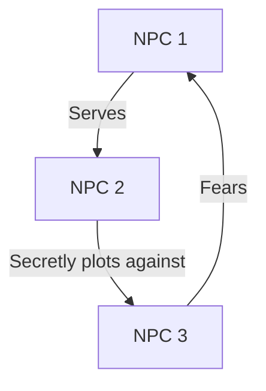

# NPC Compendium

## Campaign: [Campaign Name]

## Quick Reference Table

| Name                  | Location | Role       | Attitude   | Last Seen   | Important For |
| --------------------- | -------- | ---------- | ---------- | ----------- | ------------- |
| [Patrick](#patrick) | [City]   | [Merchant] | [Friendly] | [Session X] | [Quest Y]     |
| [NPC 2]               | [Forest] | [Villain]  | [Hostile]  | [Session Z] | [Main Plot]   |

---

## Detailed NPC Profiles

### Patrick

**Role:** [Shopkeeper/Quest Giver/Villain/etc.]  
**Race:** [Human/Elf/Dwarf/etc.]  
**Occupation:** [Their job or role in society]

#### Appearance

- **Age:** [Young/Middle-aged/Old/Ancient]
- **Notable Features:** [Scars/Tattoos/Unusual characteristics]
- **Typical Attire:** [How they usually dress]
- **Mannerisms:** [Unique gestures or behaviors]

#### Personality

- **Traits:** [Key personality characteristics]
- **Ideals:** [What they believe in]
- **Bonds:** [What they care about]
- **Flaws:** [Their weaknesses]

#### Voice Notes

- **Accent:** [Any specific accent to use]
- **Catchphrases:** [Things they often say]
- **Speech Pattern:** [Fast/Slow/Eloquent/Simple]

#### Background

- **Origin:** [Where they're from]
- **History:** [Relevant backstory]
- **Family:** [Known family members]
- **Connections:** [Other NPCs they're connected to]

#### Goals & Motivations

- **Short-term:** [What they want right now]
- **Long-term:** [What they ultimately want]
- **Methods:** [How they pursue their goals]

#### Resources

- **Wealth Level:** [Poor/Modest/Wealthy/etc.]
- **Important Items:** [Significant items they possess]
- **Abilities:** [Known powers or skills]
- **Allies:** [Who they can call upon]

#### Relationship to Party

- **First Meeting:** [When and how we met]
- **Current Standing:** [How they view us]
- **History of Interactions:**
  1. [Session X]: [What happened]
  2. [Session Y]: [What happened]

#### Secrets & Information

- **Known Secrets:** [What we know about them]
- **Suspected Secrets:** [What we think we know]
- **Information They Have:** [What they know that we might need]

#### Combat Information

_(If applicable)_

- **Estimated Level:** [If known]
- **Known Abilities:** [Observed powers/spells]
- **Weaknesses:** [Known vulnerabilities]
- **Typical Tactics:** [How they fight]

#### Associated Quests

- **Active Quests:**
  - [Quest Name]: [Their role]
- **Completed Quests:**
  - [Quest Name]: [How it resolved]
- **Potential Quests:**
  - [Possible future quests involving them]

#### Location & Movement

- **Residence:** [Where they live]
- **Frequented Locations:** [Where they can usually be found]
- **Movement Pattern:** [Any regular routes or travel]

#### Notes & Reminders

- [Important details to remember]
- [Potential plot hooks]
- [Player theories about this NPC]

---

## NPC Categories

### 🏪 Merchants

- [NPC Name] - [Shop Name]
  - Specialty: [What they sell]
  - Price Range: [Cheap/Moderate/Expensive]

### ⚔️ Quest Givers

- [NPC Name]
  - Quest Types: [What kinds of quests they give]
  - Reliability: [How trustworthy their quests are]

### 👑 Authority Figures

- [NPC Name] - [Title]
  - Jurisdiction: [What they have authority over]
  - Attitude to Party: [How they view us]

### 🎭 Entertainers

- [NPC Name]
  - Performance Type: [What they do]
  - Usual Location: [Where to find them]

---

## Organization Members

### 🏰 [Organization Name]

#### Leadership

- [Leader Name] - [Role]
  - Brief Notes: [Key information]

#### Notable Members

- [Member Name] - [Role]
  - Brief Notes: [Key information]

---

## Location-Based NPC Lists

### 🏠 [City/Region Name]

- [NPC Name]: [Quick note about role/importance]
- [NPC Name]: [Quick note about role/importance]

---

## Timeline of NPC Events

- **[Session Date]:** [NPC] did [action]
- **[Session Date]:** [NPC] revealed [information]

---

## Relationship Map

---

## Faction Affiliations

### ⚔️ [Faction Name]

- **Allied NPCs:**
  - [NPC Name] - [Role in faction]
- **Opposed NPCs:**
  - [NPC Name] - [Why they oppose]

---

## Recurring NPC Encounters

| Session | NPCs Present | Location | Outcome         |
| ------- | ------------ | -------- | --------------- |
| [X]     | [Names]      | [Place]  | [What happened] |

---

_Last Updated: [Date]_
